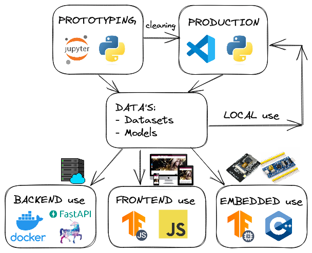

# HandwritingRecognition

1. Local prototyping with Jupyter Notebook
2. Formatting in classes with VisualStudioCode
3. Model export -> conversion -> compression
4. Browser APP using tfjs

# Implementation status
- Digits ✅ 
- Classification ✅ 
- Object Detection ✅ 
- Multiple Objects Detection (R-CNN) ⭕ 

# Snapshoot App

